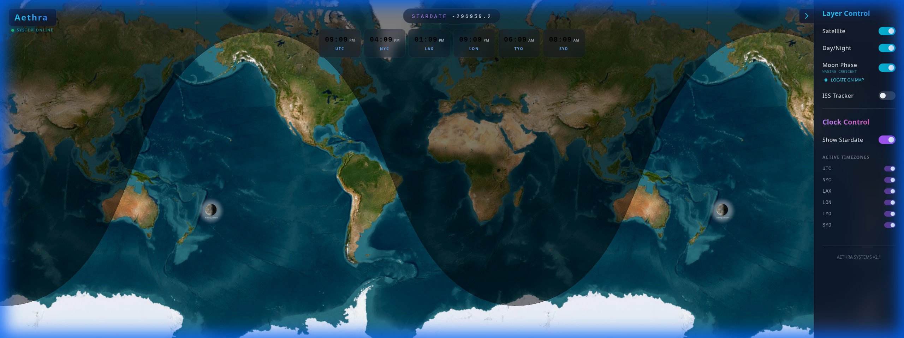

<p align="center">
  
</p>

# Aethra 

**Aethra** is a high-performance, modular geospatial dashboard inspired by the Geochron 4K. Built with a modern **React + FastAPI** stack, it visualizes the Earth in real-time, rendering light, shadow, and global data with stunning precision.

Aethra is designed to be lightweight, extensible, and easy to deploy on low-power hardware (like a Raspberry Pi) or a dedicated home dashboard display.

## Key Features

- **Dynamic Map Visuals**: Real-time daylight terminator (day/night boundary) powered by MapLibre GL.
- **Clock Widgets**: Customizable world clocks with glassmorphism design, supporting multiple timezones (Local, UTC, etc.).
- **Stardate Calculation**: Integrated Stardate display for a futuristic touch.
- **Celestial Tracking**: Visual tracking of the Sun, Moon, and ISS (International Space Station).



- **Modern Tech Stack**: Fast development and deployment with Vite, Tailwind CSS, and FastAPI.
- **Docker Ready**: One-command setup for the entire stack.

## Tech Stack

- **Frontend**: [React](https://reactjs.org/), [Vite](https://vitejs.dev/), [Tailwind CSS](https://tailwindcss.com/)
- **Mapping**: [MapLibre GL JS](https://maplibre.org/)
- **Backend**: [FastAPI](https://fastapi.tiangolo.com/) (Python)
- **Containerization**: [Docker](https://www.docker.com/) & [Docker Compose](https://docs.docker.com/compose/)

## Getting Started

The recommended way to run Aethra is using **Docker Compose**. This ensures all dependencies and services are correctly configured.

### Prerequisites

- [Docker](https://docs.docker.com/get-docker/)
- [Docker Compose](https://docs.docker.com/compose/install/)

### Installation

1. **Clone the repository**:
   ```bash
   git clone https://github.com/jospf/aethra.git
   cd aethra
   ```

2. **Start the services**:
   ```bash
   docker compose up -d
   ```

3. **Access the dashboard**:
   Open your browser and navigate to:
   ```
   http://localhost:3000
   ```

---

## Development Setup

If you wish to run the components manually for development:

### Backend (FastAPI)
```bash
cd backend
python3 -m venv venv
source venv/bin/activate
pip install -r requirements.txt
python main.py
```

### Frontend (Vite + React)
```bash
cd frontend
npm install
npm run dev
```

---

## Project Structure

```text
.
├── backend/            # FastAPI source code
├── frontend/           # React + Vite source code
├── legacy/             # Original implementation and assets
└── docker-compose.yml  # Container orchestration
```

## License

MIT License. See `LICENSE` file for details.

---

*"The sky is not the limit when you render the Earth in real time."*
