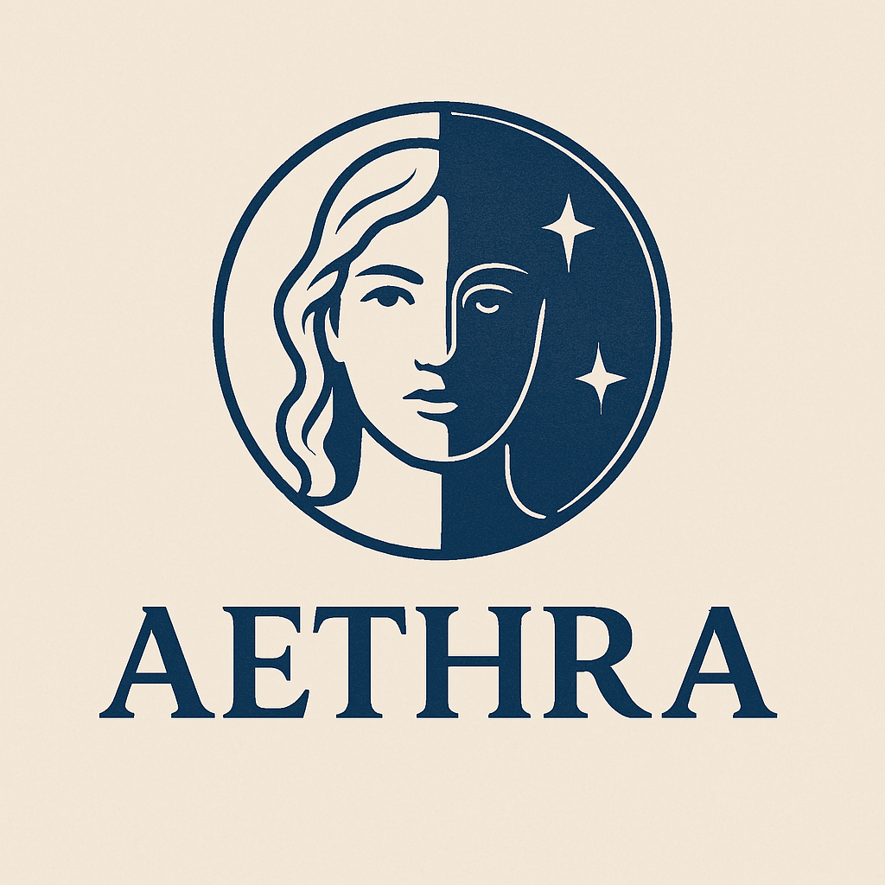

#  Aethra 🌍

**Aethra** Named after the bright sky goddess, Aethra renders the world in light and shadow.
 

## Features
- Fullscreen world map (MapLibre GL JS)
- Ready for twilight/terminator overlays, time zones, and plugins

## Getting Started
1. Open `index.html` in any modern browser.
2. Pan, zoom, and explore the world!

## Deployment
Run locally or copy to a kiosk machine. Kiosk mode example (Chromium):
```bash
chromium-browser index.html --kiosk
```

## License
MIT
