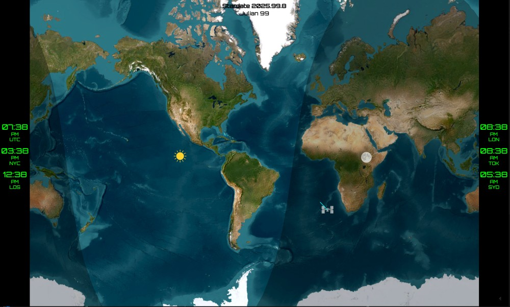

<p align="center">
  
</p>

# Aethra 🌍

**Aethra** Named after the bright sky goddess, Aethra renders the world in light and shadow.

Aethra is a modular, plugin-based world map dashboard inspired by the Geochron 4k. It displays global data like the ISS position, daylight terminator, Stardate, and multiple timezones in a configurable layout. Built to run locally on low-power hardware and scale via plugins.

## ✨ Features

- MapLibre-based world map with terminator overlay
- Plugin-driven architecture for extensibility
- Clock panels with multiple timezones
- Stardate display
- Real-time ISS tracking
- Sun/Moon subpoints from local or backend API



## ⚙️ Requirements

- A modern browser (Chrome/Edge/Firefox)
- Python 3 (for optional Flask backend)
- A simple HTTP server (for local development)

## 🚀 Getting Started

### 1. Clone the repository:

```bash
git clone https://github.com/jospf/aethra.git
cd aethra
```

### 2. Install Python dependencies (optional backend):

From the repository root (where `server.py` lives):

```bash
python3 -m venv venv
source venv/bin/activate
pip install -r requirements.txt
python server.py
```

This enables backend features like celestial subpoints (sun/moon).

### 3. Start local development frontend:

From the root project folder (where `index.html` is):

```bash
python3 -m http.server 8000
```

Then open in your browser:

```
http://localhost:8000
```

### 4. Configure Your Dashboard

Edit `config.json` to set:

- Active plugins
- Your geographic location
- Timezones to display

Example `config.json`:

```json
{
  "location": {
    "name": "Portland, OR",
    "latitude": 45.5152,
    "longitude": -122.6784
  },
  "plugins": ["clock", "sunmoon", "iss"],
  "timezones": [
    { "tz": "UTC", "label": "UTC" },
    { "tz": "America/New_York", "label": "NYC" },
    { "tz": "Asia/Tokyo", "label": "TYO" }
  ]
}
```

---

## 📂 Project Status

This is an evolving personal project. Core components are in place and plugin development is ongoing. Contributions, suggestions, and feature ideas are welcome.

---

## 📁 License

MIT License. See `LICENSE` file for details.

---

*"The sky is not the limit when you render the Earth in real time."*

